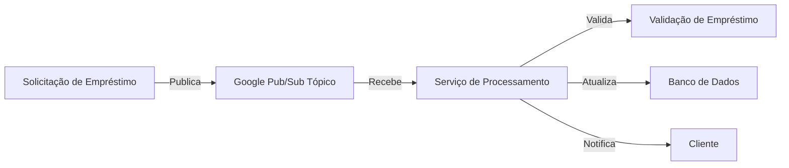

# 📘 CsharpAspirePubSub

> Solução de solicitação e processamento de empréstimos utilizando **Google Cloud Pub/Sub** e **.NET Aspire**.


---

## 📖 Visão Geral

O **CsharpAspirePubSub** tem como objetivo:

* Demonstrar como implementar um **padrão Publish‑Subscribe** em .NET para processamento de empréstimos.  
* Utilizar o **Google Cloud Pub/Sub** como mecanismo de mensageria para comunicação assíncrona entre serviços.  
* Servir como referência para arquiteturas distribuídas de microsserviços em .NET Aspire.  

Ideal para desenvolvedores que desejam:

* Aprender a integrar .NET com Google Pub/Sub.  
* Implementar sistemas de processamento assíncrono de tarefas (ex: solicitações de empréstimo).  
* Ter um template de projeto de mensageria robusto e escalável.

---

## 🧩 Estrutura do Projeto

```mermaid
graph TD
    A[CsharpAspirePubSub]
    B[Publisher]
    C[Subscriber]
    D[Shared]
    E[Program.cs - Publisher]
    F[Program.cs - Subscriber]
    G[Config]

    A --> B
    A --> C
    A --> D
    A --> E
    A --> F
    A --> G
````

**Descrição das pastas:**

* `Publisher` → Serviço que publica mensagens de solicitação de empréstimos no tópico Pub/Sub
* `Subscriber` → Serviço que consome mensagens de empréstimo e processa o workflow
* `Shared` → Contratos, DTOs e utilitários compartilhados entre Publisher e Subscriber
* `Program.cs` → Arquivos de inicialização e configuração dos serviços
* `Config` → Configurações de conexão com Google Pub/Sub e variáveis de ambiente

---

## 🧪 Tecnologias Utilizadas

* **.NET 8 / .NET Aspire** — Backend moderno e performático
* **C#** — Linguagem principal
* **Google Cloud Pub/Sub** — Mensageria assíncrona escalável
* **Entity Framework Core** (opcional, se houver banco) — Persistência de dados
* **Mermaid** — Diagramas para visualização da arquitetura

---

## ⚙️ Pré‑requisitos

Antes de executar o projeto localmente, garanta que você tenha:

* ✅ [.NET 8 SDK](https://dotnet.microsoft.com/download/dotnet/8.0)
* ✅ Conta e projeto no **Google Cloud** com Pub/Sub habilitado
* ✅ Chave de autenticação JSON do serviço do Google Cloud
* ✅ Visual Studio 2022 ou VS Code

---

## 🚀 Como Executar Localmente

1. Clone este repositório:

```bash
git clone https://github.com/thiagodsantana/CsharpAspirePubSub.git
cd CsharpAspirePubSub
```

2. Configure as credenciais do Google Cloud:

```bash
set GOOGLE_APPLICATION_CREDENTIALS=path\to\service-account.json
```

3. Restaure dependências:

```bash
dotnet restore
```

4. Execute o **Subscriber** (primeiro para receber mensagens):

```bash
dotnet run --project Subscriber
```

5. Execute o **Publisher** para enviar solicitações de empréstimo:

```bash
dotnet run --project Publisher
```

6. Observe os logs no Subscriber para verificar o processamento das mensagens.

---

## 💡 Objetivo Educacional

Este projeto serve para:

* Fornecer uma base prática sobre **mensageria assíncrona** com Google Pub/Sub e .NET
* Demonstrar um padrão **Publish-Subscribe** aplicado a processamento de empréstimos
* Servir como template para sistemas distribuídos e escaláveis

---

## 📊 Diagrama de Fluxo de Mensagens



Este diagrama mostra o fluxo completo: da publicação da solicitação até a validação, persistência e notificação.

---

## 🧪 Exemplos de Uso

### Publicar uma solicitação de empréstimo

```csharp
var emprestimo = new SolicitacaoEmprestimo {
    ClienteId = "12345",
    Valor = 5000,
    Parcelas = 12
};

await publisher.PublishAsync(emprestimo);
```

### Processar mensagens recebidas

```csharp
subscriber.Subscribe<SolicitacaoEmprestimo>(mensagem => {
    Console.WriteLine($"Processando empréstimo do cliente {mensagem.ClienteId}");
    // validação, persistência e notificações
});
```

---

## 📚 Boas Práticas

* Use tópicos e assinaturas separados por domínio ou serviço
* Evite processamentos longos dentro do handler; prefira filas internas ou jobs
* Monitore métricas de Pub/Sub e logs de processamento
* Utilize DTOs para padronizar mensagens entre Publisher e Subscriber

---

## 🤝 Contribuindo

1. Faça um fork do repositório
2. Crie uma branch de feature:

```bash
git checkout -b feature/nova-funcionalidade
```

3. Adicione melhorias ou exemplos
4. Faça commit das alterações:

```bash
git commit -m "Adiciona feature X ao CsharpAspirePubSub"
```

5. Envie para o fork:

```bash
git push origin feature/nova-funcionalidade
```

6. Abra um Pull Request

---

## 🪪 Licença

Este projeto está sob a **Licença MIT** — livre para uso, estudo e modificação.

---

## ✉️ Contato

**Autor:** [Thiago D. Santana](https://github.com/thiagodsantana)
**LinkedIn:** [linkedin.com/in/thiagodsantana](https://linkedin.com/in/thiagodsantana)
**E-mail:** [thiago.darley@gmail.com](mailto:thiago.darley@gmail.com)
