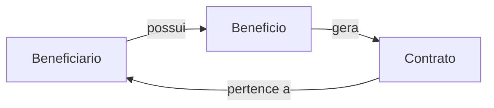

# 📘 GraphQLConsig

> Projeto de exemplo de **API GraphQL** utilizando HotChocolate em .NET, com foco em gerenciamento de beneficiários, benefícios e contratos de empréstimo consignado.


---

## 📖 Visão Geral

O **GraphQLConsig** tem como objetivo:

* Demonstrar como construir uma API GraphQL no .NET usando HotChocolate.  
* Mostrar casos de uso de **queries**, **mutations** e **subscriptions**.  
* Servir como base para projetos que precisam de APIs performáticas e bem estruturadas.  
* Exibir relações entre entidades como **Beneficiários**, **Benefícios** e **Contratos**.

Ideal para desenvolvedores que desejam:

* Entender como estruturar um projeto GraphQL no .NET  
* Aprender a configurar queries, mutations e subscriptions  
* Ter um template pronto para APIs corporativas com HotChocolate  

---

## 🧩 Estrutura do Projeto

```mermaid
graph TD
    A[GraphQLConsig]
    B[Consignado.API]
    C[Consignado.Domain]
    D[Consignado.Infrastructure]
    E[Consignado.GraphQL]
    F[Program.cs]
    G[appsettings.json]

    A --> B
    A --> C
    A --> D
    A --> E
    A --> F
    A --> G
````

**Descrição das pastas:**

* `Consignado.API` → Projeto principal da API, com controllers e configuração GraphQL
* `Consignado.Domain` → Modelos e entidades de negócio (Beneficiário, Benefício, Contrato)
* `Consignado.Infrastructure` → Contexto do banco de dados, repositórios e migrations
* `Consignado.GraphQL` → Schemas, queries, mutations, subscriptions e resolvers
* `Program.cs` → Configuração da aplicação e startup da API
* `appsettings.json` → Configuração de conexão com banco e variáveis de ambiente

---

## 🧪 Tecnologias Utilizadas

* **.NET 8** — Plataforma moderna e performática para backend
* **C#** — Linguagem principal
* **HotChocolate** — Framework GraphQL para .NET
* **SQL Server** — Banco de dados relacional
* **Entity Framework Core** — ORM para acesso e migrations
* **Mermaid** — Diagramas para visualização da estrutura

---

## ⚙️ Pré‑requisitos

Antes de executar o projeto localmente, garanta que você tenha:

* ✅ [Visual Studio 2022](https://visualstudio.microsoft.com/) ou [VS Code](https://code.visualstudio.com/)
* ✅ [.NET 8 SDK](https://dotnet.microsoft.com/download/dotnet/8.0)
* ✅ SQL Server ou outra instância compatível
* ✅ Conhecimentos básicos de C# e GraphQL

---

## 🚀 Como Executar Localmente

1. Clone este repositório:

```bash
git clone https://github.com/thiagodsantana/GraphQLConsig.git
cd GraphQLConsig
```

2. Restaure dependências:

```bash
dotnet restore
```

3. Configure a string de conexão em `appsettings.json`:

```json
"ConnectionStrings": {
  "DefaultConnection": "Server=localhost;Database=GraphQLConsigDB;Trusted_Connection=True;"
}
```

4. Execute migrations:

```bash
dotnet ef database update --project Consignado.API
```

5. Execute a aplicação:

```bash
dotnet run --project Consignado.API
```

6. Acesse o **playground GraphQL**:

```
http://localhost:5000/graphql
```

---

## 💡 Objetivo Educacional

Este projeto serve para:

* Fornecer uma base prática de estudo sobre GraphQL com .NET
* Servir como template para times que desejam adotar GraphQL
* Facilitar workshops ou treinamentos sobre arquitetura de APIs distribuídas e design de schemas eficientes

---

## 📊 Diagrama de Relacionamento de Entidades



Este diagrama mostra a relação entre **Beneficiários**, **Benefícios** e **Contratos**.

---

## 🧪 Exemplos de Queries, Mutations e Subscriptions

### Query – Consultar beneficiários

```graphql
query {
  beneficiarios {
    cpf
    nome
    beneficios {
      tipo
      valor
      contratos {
        parcelas
        valorTotal
        taxaJuros
      }
    }
  }
}
```

### Mutation – Criar beneficiário

```graphql
mutation {
  criarBeneficiario(input: {
    nome: "Maria Silva",
    cpf: "98765432100"
  }) {
    id
    nome
    cpf
  }
}
```

### Subscription – Notificação de novo contrato

```graphql
subscription {
  novoContrato {
    id
    valorTotal
    parcelas
    beneficiario {
      nome
      cpf
    }
  }
}
```

---

## 📚 Boas Práticas

* Separe claramente **queries, mutations e subscriptions**
* Evite retornar grandes volumes de dados sem paginação
* Utilize DTOs para separar modelos de banco e GraphQL
* Monitore performance e logging das queries em produção
* Documente schemas e resolvers para facilitar manutenção

---

## 🤝 Contribuindo

1. Faça um fork do repositório
2. Crie uma branch de feature:

```bash
git checkout -b feature/nova-funcionalidade
```

3. Adicione melhorias ou exemplos
4. Faça commit das alterações:

```bash
git commit -m "Adiciona funcionalidade X ao GraphQLConsig"
```

5. Envie para o fork:

```bash
git push origin feature/nova-funcionalidade
```

6. Abra um Pull Request

---

## 🪪 Licença

Este projeto está sob a **Licença MIT** — livre para uso, estudo e modificação.

---

## ✉️ Contato

**Autor:** [Thiago D. Santana](https://github.com/thiagodsantana)
**LinkedIn:** [linkedin.com/in/thiagodsantana](https://linkedin.com/in/thiagodsantana)
**E-mail:** [thiago.darley@gmail.com](mailto:thiago.darley@gmail.com)
